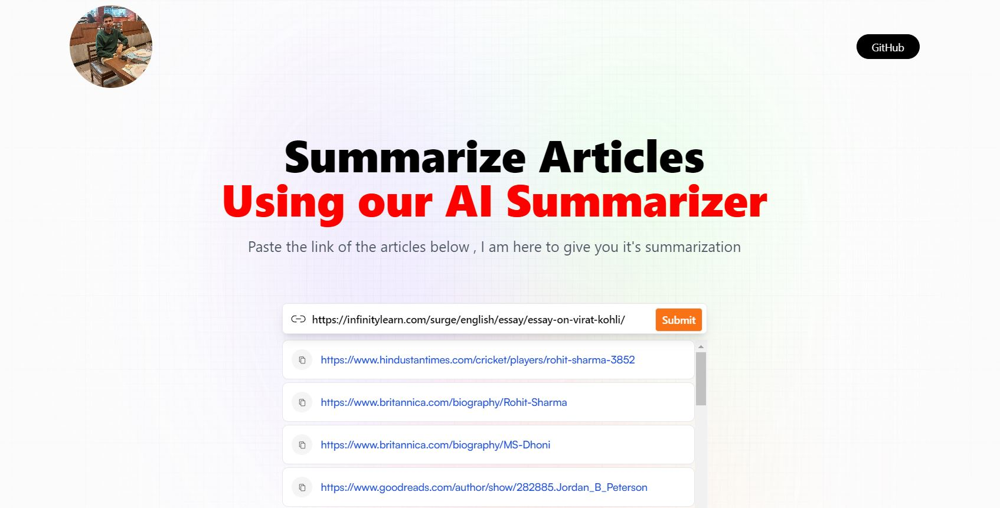
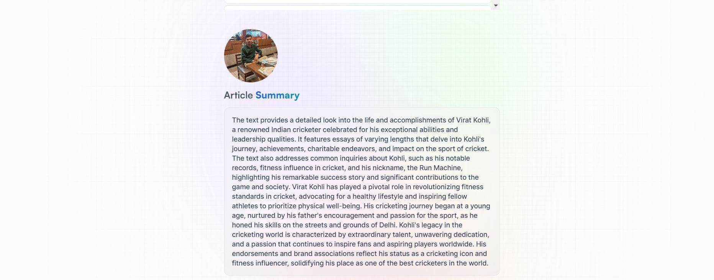

# Article-Summarizer
# Article Summarization using OpenAI's ChatGPT API

# TechStack Used 
ReactJs, Vite, Tailwind CSS, Redux Toolkit, RapidApi

## Introduction
This project utilizes OpenAI's ChatGPT API for text summarization. Given a link to a paragraph or text, the API generates a summary of the content. 

## Instructions
1. **Input**: Provide a link to the paragraph or text that needs summarization.
2. **Output**: Receive a summarized version of the input text.
3. **Usage**: The provided summarization can be used for various purposes such as condensing lengthy articles, extracting key points, or generating abstracts.

## Example
### Input
![pic1]summa2.JPG)

### Output

